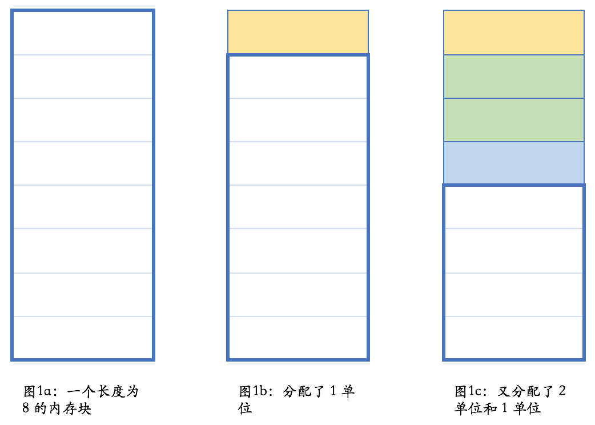
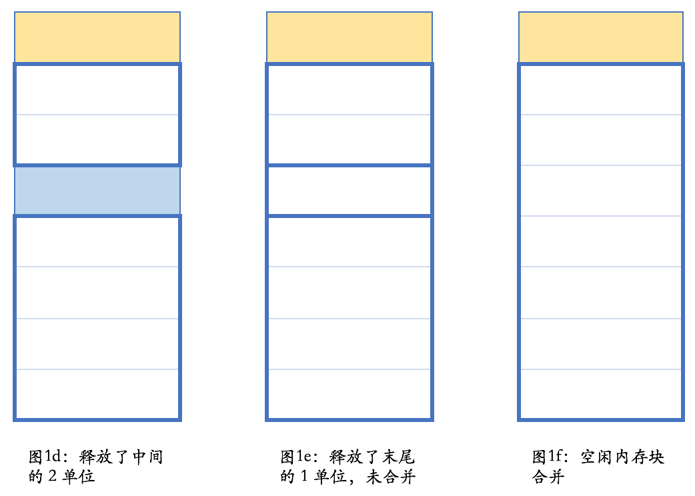

---

- [基本概念](#基本概念)
  - [heap](#heap)
  - [栈](#栈)
  - [RAII](#raii)

### 基本概念

#### heap

* 在内存管理的语境下。是指动态分配内存的区域。
* 需要手动释放，不然会泄漏
* malloc 和 free 操作的区域是 heap



**free store: 自由存储区**

* new 和 delete 操作的区域就是 free store

#### 栈

* 英文是 stack，在内存管理的语境下，指的是函数调用过程中产生的本地变量和调用数据的区域。 LIFO
* 分配内存实例：

* 内存分配：
  * 栈上的分配极为简单，移动一下栈指针而已。
  * 栈上的释放也极为简单，函数执行结束时移动一下栈指针即可。
  * 由于后进先出的执行过程，不可能出现内存碎片。

**堆内存管理3个操作(都不简单)**

1. 让内存管理器分配一个某个大小的内存
2. 让内存管理器释放一个之前分配的内存块
3. 让内存管理器进行垃圾收集操作，寻找不再使用的内存块并予以释放

**C++处理1 和 2**

---
**内存泄漏**

```C++
void foo()
{
  bar* ptr = new bar();
  …
  delete ptr;
}
```

```C++
bar* make_bar(…)
{
  bar* ptr = nullptr;
  try {
    ptr = new bar();
    …
  }
  catch (...) {
    delete ptr;
    throw;
  }
  return ptr;
}
void foo()
{
  …
  bar* ptr = make_bar(…)
  …
  delete ptr;
}
```

**不管是否发生异常，析构函数都会被调用**

#### RAII

* 完整的英文是 Resource Acquisition Is Initialization
* RAII 依托栈和析构函数，来对所有的资源——包括堆内存在内——进行管理。
* 依托析构函数函数做资源管理

---

**在很多情况下，对象不能，或不应该，存储在栈上**

* 对象很大
* 对象的大小不能在编译时确定
* 对象是函数的返回值，但由于特殊原因，不应使用对象的返回值。常见情况之一是，在工厂方法或者其他面向对象编程的情况下，返回值类型是基类（的指针或饮用）

```c++
enum class shape_type {
  circle,
  triangle,
  rectangle,
  …
};

class shape { … };
class circle : public shape { … };
class triangle : public shape { … };
class rectangle : public shape { … };

shape* create_shape(shape_type type)
{
  …
  switch (type) {
  case shape_type::circle:
    return new circle(…);
  case shape_type::triangle:
    return new triangle(…);
  case shape_type::rectangle:
    return new rectangle(…);
  …
  }
}
```

如上代码如果返回值类型是shape，实际却返回一个circle，编译器不会报错，但是结果多半是错误的。这种现象叫对象切片（object slicing)

---
回到工厂方法这里

**如何保证不内存泄漏，一个解决方案：利用析构函数释放指针**

```C++
class shape_wrapper {
public:
  explicit shape_wrapper(
    shape* ptr = nullptr)
    : ptr_(ptr) {}
  ~shape_wrapper()
  {
    delete ptr_;
  }
  shape* get() const { return ptr_; }
private:
  shape* ptr_;
};

void foo()
{
  …
  shape_wrapper ptr_wrapper(
    create_shape(…));
  …
}
```

**delete空指针，是一个合法的空操作**

**new一个对象的语义：**

* 先分配内存，异常抛bad_alloc异常，然后在这个结果指针上构造对象；
* 构造成功则new操作完成，否则释放内存并向外抛出异常

```C++
// new circle(…)
{
  void* temp = operator new(sizeof(circle));
  try {
    circle* ptr =
      static_cast<circle*>(temp);
    ptr->circle(…);
    return ptr;
  }
  catch (...) {
    operator delete(ptr);
    throw;
  }
}
```

**delete 语义**

* 先检查指针存在性，再删除

```c++
if (ptr != nullptr) {
  ptr->~shape();
  operator delete(ptr);
}
```

---
**RAII：在析构时做必要的清理工作。不限于内存，文件，同步锁，其他资源**
所以，我们应该使用：

```C++
std::mutex mtx;
void some_func()
{
  std::lock_guard<std::mutex> guard(mtx);
  // 做需要同步的工作
}
```

而不是：

```c++

std::mutex mtx;

void some_func()
{
  mtx.lock();
  // 做需要同步的工作……
  // 如果发生异常或提前返回，
  // 下面这句不会自动执行。
  mtx.unlock();
}
```

以上其实实现了一个简单版本的智能指针
