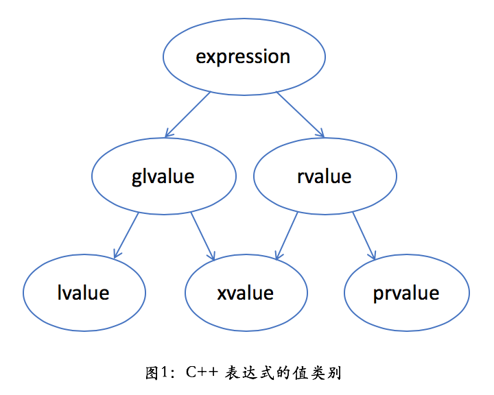
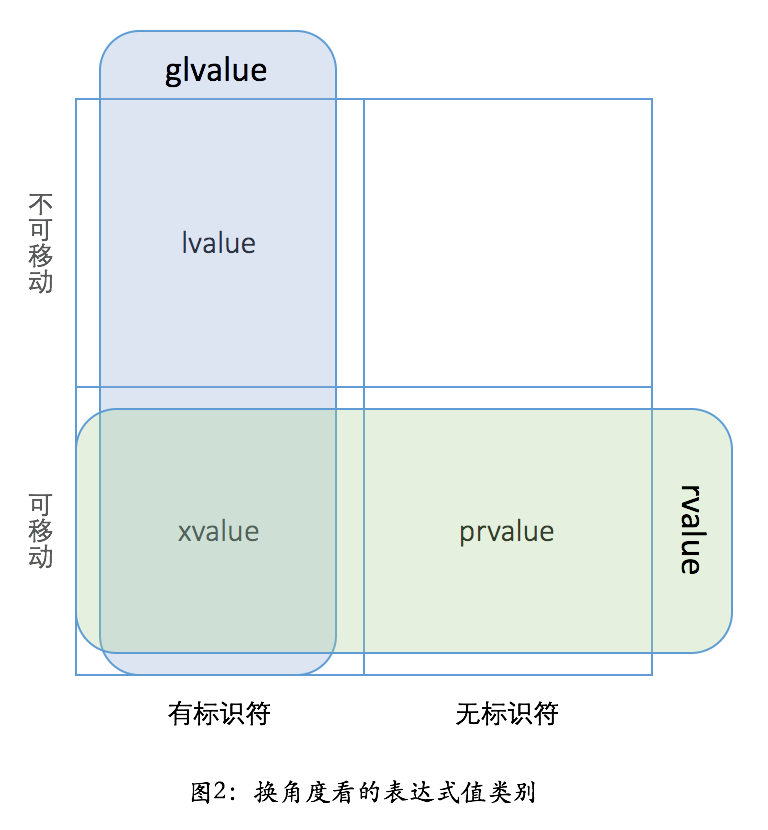

- [- 引用塌缩和完美转发](#--引用塌缩和完美转发)
  - [值分左右](#值分左右)
    - [C++表达式的类型](#c表达式的类型)
      - [左值lvalue](#左值lvalue)
      - [纯右值](#纯右值)
      - ["值类别"（value category）vs. "值类型"value type](#值类别value-categoryvs-值类型value-type)
  - [生命周期和表达式类型](#生命周期和表达式类型)
  - [移动的意义](#移动的意义)
  - [如何实现移动](#如何实现移动)
  - [不用返回本地变量的引用](#不用返回本地变量的引用)
  - [引用塌缩和完美转发](#引用塌缩和完美转发)
---

### 值分左右

#### C++表达式的类型

    * lvalue 是通常可以放在等号左边的表达式，左值
    * rvalue是通常只能放在右边的表达式
    * gvalue 是generalized lvalue, 广义左值
    * xvalue 是expiring lvalue， 将亡值
    * prvalue是pure rvalue，纯右值


##### 左值lvalue

* 标识符、可以取地址的表达式，常见的情况
  * 变量、函数或数据成员的名字
  * 返回左值引用的表达式，如 ++x, x = 1 cout << ' '
  * 字符串字面量 如“hello world”
* 左值可以绑定到左值引用的参数，如T&
* 一个常量只能绑定到常左值引用，如const T&

##### 纯右值

* 没有标识符、不可取地址的表达式，一般也称之为“临时对象。 常见情况
  * 返回非引用类型的表达式。x++m x + 1, make_shared<int>(42)
  * 除字符串字面量之外的字面量，如42、true
* C++ 11之前，右值可以绑定到常左值引用的参数，如const T&， 但不可以绑定到非常左值引用，如T&。
* 从C++11开始，多了一种引用类型-右值引用。

* 右值的引入目的是减少对象构造造成的性能损耗。 对象传参使用引用传递尽量避免值传递，目的是减少对象构造。指针传参并没有这个问题，所以不在乎左值/右值传递
 **类型是右值引用的变量是一个左值
* std::move(ptr)
  * 把一个左值引用强制转化为一个右值引用，而不改变其内容。
  * 可以看做是一个有名字的右值。
  * 为了跟无名的纯右值prvalue相区别，C++里目前把这种表达式叫做xvalue
  * xvalue 仍然是不能取地址的，与prvalue相同。所以被归为rvalue。

 

##### "值类别"（value category）vs. "值类型"value type

* 前者指的是左值、右值相关的概念（左值/右值）
* 后者则是与引用类型(reference type)相对而言，表明一个变量是代表实际数值，还是引用另外一个数值。（值/引用）
* 在C++里，所有的原生类型、枚举、结构、联合、类都代表值类型，只有引用和指针才是引用类型

 ---

### 生命周期和表达式类型

* 一个变量的生命周期在超出作用域时结束。
* 临时对象呢？
  * 一个临时对象会在包含这个临时对象的完整表达式估值完成后、按生成顺序的逆序被销毁。（因为栈展开的问题）
  * 除非有生命周期延长发生。
  * 一个例子：

```C++
#include <stdio.h>

class shape {
public: 
virtual ~shape() {}
};

class circle : public shape {
public:
  circle() { puts("circle()"); }
  ~circle() { puts("~circle()"); }
};

class triangle : public shape {
public:
  triangle() { puts("triangle()"); }
  ~triangle() { puts("~triangle()"); }
};

class result {
public:
  result() { puts("result()"); }
  ~result() { puts("~result()"); }
};

result
process_shape(const shape& shape1,
              const shape& shape2)
{
  puts("process_shape()");
  return result();
}

int main()
{
  puts("main()");
  process_shape(circle(), triangle());
  puts("something else");
}
```

输出结果可能是（circle 和 triangle的顺序标准中没有规定）
>main()
circle()
triangle()
process_shape()
result()
~result()
~triangle()
~circle()
something else
  
**生命周期延长规则**

* 如果一个prvalue被绑定到一个引用上，它的生命周期则会延长到这个引用变量一样长

    如果将process_shape那行改成：

```C++
result&& r = process_shape( circle(), triangle());
```

则结果：
> main()
> circle()
> triangle()
> process_shape()
> result()
> ~triangle()
> ~circle()
> something else
> ~result()

* **这条规则只对prvlaue有效，对xvalue无效**
* 改成如下代码，则又变成了之前的输出

```c++
#include <utility>  // std::move
…
result&& r = std::move(process_shape(circle(), triangle()));
```

---

### 移动的意义

理解为什么，熟练掌握基本的用法
**smart_ptr:**

* 使用右值引用的目的是实现移动，实现移动的意义在于减少运行的开销。开销并不大
* 移动构造和拷贝构造的差异
  * 少了一次 other.shared_count->add_count()的调用
  * 被移动的指针被清空，因为少了一次shared_count->reduce_count() 的调用

**在使用容器的情况下，移动更有意义**

```C++
string result =  string("Hello, ") + name + ".";
```

* C++ 11之前：
    1. 调用构造函数string(const char*) 生成临时对象1"Hello," 复制一次
    2. 调用operator+(const string&, const string&） 生成临时对象2;"Hello," 复制两次，name复制一次
    3. 调用operator+(const string&, const string&） 生成临时对象3；"Hello," 复制3次，name复制两次。 "." 复制1次
    4. 假设返回值优化能够继续生效，对象3可以直接在result里构造完成。
    5. 临时对象2析构，释放指向string("Hello,"）+ name的内存
    6. 临时对象1析构，释放指向string("Hello,") 的内存

* 一个更高效的写法：
  * 执行一次构造，和两次operator+=
  * 没有临时对象生成和析构，所有的字符串都只复制了一次。
  * 效率高，但是代码啰嗦

```C++
string result = "Hello, ";
result += name;
result += ".";
```

* C++11之后（还用优化之前的代码）：
    1. 调用构造函数string(const char*) 生成临时对象1：“Hello，”复制1次
    2. 调用operator+(string &&, const string&) 直接在临时对象1上面执行追加操作，并把结果移动到临时对象2，name复制一次
    3. 调用operator+(string &&, const char* )直接在临时对象2上面执行追加操作，并把结果移动到result； "."复制1次
    4. 临时对象2析构，内容已经为空，不需要释放任何内存
    5. 临时对象1析构，内容已经为空，不需要释放任何内存
* 比较：
  * 代码可读性很高。 任然需要复制，但是只需要一次，效率很高

**C++对象缺省都是值语义**

* 优点： 保证了内存访问的局域性
* 缺点： 复制对象的开销增大

**移动语义使得在C++里返回大对象（如容器）的函数和运算符成为现实，因为可以提高代码的简洁性和可读性，提高生产效率**

所有的现代C++的标准容器都针对移动进行了优化

---

### 如何实现移动

需要如下几步：

1. 对象应该有分开的拷贝构造和移动构造（除非只打算支持移动，不支持copy，如unique_ptr）
2. 对象应该有swap函数，支持和另外一个对象快速交换成员
3. 在对象的命名空间下，应该有一个全局的swap函数，调用成员函数的swap来实现交换。方便别人在其他对象里包含你的对象，并快速实现他们的swap函数
4. 实现通用的operator=
5. 上面各个函数如果不抛异常，应当标noexcept。这对移动构造函数尤为重要

### 不用返回本地变量的引用

* 未定义行为

**返回一个本地对象**

* C++11之前： 意味着对象会被拷贝。除非编译器发现可以做返回值优化（named return value optimization， NRVO），能把对象直接构造到调用者的栈上
* 在C++11之后： 返回值优化仍可以发生，但在没有发生的情况下，编译器将试图把本地对象移动出去，而不是copy出去。**这一行为不需要程序员用std::move进行干预---使用std::move对于移动行为没有帮助，反而影响返回值优化。**

### 引用塌缩和完美转发

**问题：**

  1. 是不是看到T&, 就一定是个左值引用？---**是**
  2. 是不是看到T&&, 就一定是个右值引用？---**不是**

**语法规则要点**

* 对于 template <typename T> foo(T&&) 这样的代码，如果传递过去的参数是左值，T 的推导结果是左值引用；如果传递过去的参数是右值，T 的推导结果是参数的类型本身
* 如果 T 是左值引用，那 T&& 的结果仍然是左值引用——即 type& && 坍缩成了 type&。
* 如果 T 是一个实际类型，那 T&& 的结果自然就是一个右值引用。

```C++
void foo(const shape&)
{
  puts("foo(const shape&)");
}

void foo(shape&&)
{
  puts("foo(shape&&)");
}

void bar(const shape& s)
{
  puts("bar(const shape&)");
  foo(s);
}

void bar(shape&& s)
{
  puts("bar(shape&&)");
  foo(s);
}

int main()
{
  bar(circle());
}
````

输出为：
> bar(shape&&)
> foo(const shape&)
