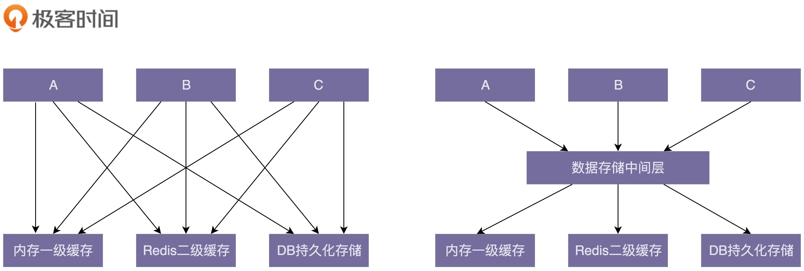

- [导读](#导读)
  - [01 | 为什么说每个程序员都要尽早地学习并掌握设计模式相关知识](#01--为什么说每个程序员都要尽早地学习并掌握设计模式相关知识)
  - [02 |从哪些维度评判代码质量的好坏？ 如何具备写出高质量代码的能力](#02-从哪些维度评判代码质量的好坏-如何具备写出高质量代码的能力)
    - [常用的评价标准](#常用的评价标准)
    - [如何写出高质量的代码？](#如何写出高质量的代码)
  - [03 | 面向对象、设计原则、设计模式、编程规范、重构，这五者关系](#03--面向对象设计原则设计模式编程规范重构这五者关系)
    - [面向对象](#面向对象)
    - [设计原则](#设计原则)
    - [设计模式](#设计模式)
    - [编程规范](#编程规范)
    - [代码重构](#代码重构)
    - [五者之间的关系](#五者之间的关系)
- [设计原则与思想：面向对象](#设计原则与思想面向对象)
  - [04 | 理论一：当谈论面向对象的时候，我们到底在谈论什么](#04--理论一当谈论面向对象的时候我们到底在谈论什么)
    - [什么是面向对象编程？](#什么是面向对象编程)
    - [什么是面向对象编程语言？](#什么是面向对象编程语言)
    - [面向对象编程和面向对象编程语言之间有何关系？](#面向对象编程和面向对象编程语言之间有何关系)
    - [什么是面向对象分析和面向对象设计？](#什么是面向对象分析和面向对象设计)
  - [05 | 理论二：封装、抽象、继承、多态分别能解决哪些编程问题](#05--理论二封装抽象继承多态分别能解决哪些编程问题)
    - [1. 关于封装性](#1-关于封装性)
    - [2.关于抽象特性](#2关于抽象特性)
    - [3.关于继承特性](#3关于继承特性)
    - [4.关于多态特性](#4关于多态特性)
  - [06 | 理论三：面向对象比面向过程有哪些优势？面向过程真的过时了吗？](#06--理论三面向对象比面向过程有哪些优势面向过程真的过时了吗)
    - [1.什么是面向过程编程？什么是面向过程编程语言？](#1什么是面向过程编程什么是面向过程编程语言)
    - [2.OOP比面向过程编程有哪些优势？](#2oop比面向过程编程有哪些优势)
  - [07 | 理论四：哪些代码设计看似是面向对象，实际是面向过程的](#07--理论四哪些代码设计看似是面向对象实际是面向过程的)
    - [1.滥用getter、setter方法](#1滥用gettersetter方法)
    - [2.滥用全局变量和全局方法](#2滥用全局变量和全局方法)
    - [3.定义数据和方法分离的类](#3定义数据和方法分离的类)
  - [08 | 理论五：接口和抽象类的区别？如何用普通的类模拟抽象类和接口](#08--理论五接口和抽象类的区别如何用普通的类模拟抽象类和接口)
    - [1.抽象类和接口的语法特性](#1抽象类和接口的语法特性)
    - [2.抽象类和接口存在的意义](#2抽象类和接口存在的意义)
    - [3. 抽象类和接口的使用场景区别](#3-抽象类和接口的使用场景区别)
  - [09 | 理论六：为什么基于接口编程而非实现编程？ 有必要为每个类如何理解原则中的“接口”二字？](#09--理论六为什么基于接口编程而非实现编程-有必要为每个类如何理解原则中的接口二字)
    - [编码层面：可理解为编程语言中的接口或者抽象类](#编码层面可理解为编程语言中的接口或者抽象类)
    - [如何应用到实战？](#如何应用到实战)
    - [是否需要为每个类定义接口？](#是否需要为每个类定义接口)
  - [10 | 理论七：为何说要多用组合少用继承？如何决定该用组合还是继承？](#10--理论七为何说要多用组合少用继承如何决定该用组合还是继承)
    - [1.为什么不推荐用继承](#1为什么不推荐用继承)
    - [2.组合相比继承有什么优势](#2组合相比继承有什么优势)
    - [3.如何判断该用组合还是继承](#3如何判断该用组合还是继承)
- [设计原则与思想：设计原则](#设计原则与思想设计原则)
  - [15 | 理论一： 对于单一职责原则，如何判定某个类的职责是否够“单一”](#15--理论一-对于单一职责原则如何判定某个类的职责是否够单一)
  - [16 | 理论二：如何做到“对扩展开放、修改关闭”？扩展和修改各指什么](#16--理论二如何做到对扩展开放修改关闭扩展和修改各指什么)
    - [1.如何理解“开闭原则”](#1如何理解开闭原则)
    - [2.如何做到？](#2如何做到)
  - [17 | 理论三：里氏替换（LSP）跟多态有何区别？哪些代码违背了LSP？](#17--理论三里氏替换lsp跟多态有何区别哪些代码违背了lsp)
    - [如何理解LSP？](#如何理解lsp)
    - [哪些代码明显违背了LSP？](#哪些代码明显违背了lsp)
  - [18 | 理论四：接口隔离原则有哪三种应用？原则中的“接口”该如何理解](#18--理论四接口隔离原则有哪三种应用原则中的接口该如何理解)
    - [如何理解“接口隔离原则”](#如何理解接口隔离原则)
    - [接口隔离原则与单一职责原则的区别](#接口隔离原则与单一职责原则的区别)
  - [19 | 理论五：控制反转、依赖反转、依赖注入，这三个有何区别和联系](#19--理论五控制反转依赖反转依赖注入这三个有何区别和联系)
    - [1. 控制反转](#1-控制反转)
    - [2. 依赖注入](#2-依赖注入)
    - [3. 依赖注入框架](#3-依赖注入框架)
    - [4.依赖反转原则](#4依赖反转原则)
  - [20 | 理论六：我为何说KISS、YANGNI原则看似简单，却经常被用错](#20--理论六我为何说kissyangni原则看似简单却经常被用错)
    - [如何理解KISS原则](#如何理解kiss原则)
    - [KISS VS. YAGNI](#kiss-vs-yagni)
  - [21 | 理论七： 重复的代码就一定违背DRY原则吗？ 如何提高代码的复用性](#21--理论七-重复的代码就一定违背dry原则吗-如何提高代码的复用性)
    - [1.DRY原则](#1dry原则)
      - [实现逻辑重复](#实现逻辑重复)
      - [功能语义重复](#功能语义重复)
      - [代码执行重复](#代码执行重复)
    - [2. 代码复用性](#2-代码复用性)
      - [什么是代码的复用性](#什么是代码的复用性)
      - [**代码复用性（Code Reusablity）VS. 代码复用（Code Reuse）VS. DRY**](#代码复用性code-reusablityvs-代码复用code-reusevs-dry)
    - [3.怎么提高代码的复用性？](#3怎么提高代码的复用性)
    - [4.辩证思考和灵活应用](#4辩证思考和灵活应用)
- [设计原则与思想：规范与重构](#设计原则与思想规范与重构)
  - [27 | 理论一： 什么情况下要重构？ 到底重构什么？ 又该如何重构](#27--理论一-什么情况下要重构-到底重构什么-又该如何重构)
    - [定义](#定义)
    - [重构的目的：为什么要重构？Why](#重构的目的为什么要重构why)
    - [重构的对象：到底重构什么？What](#重构的对象到底重构什么what)
    - [重构的时机：什么时候重构？When](#重构的时机什么时候重构when)
    - [重构的方法：如何重构？ How](#重构的方法如何重构-how)
  - [30 | 理论四： 如何通过封装、抽象、模块化、中间层等解耦代码](#30--理论四-如何通过封装抽象模块化中间层等解耦代码)
    - [1.“解耦”为何如此重要](#1解耦为何如此重要)
    - [2. 代码是否需要“解耦”](#2-代码是否需要解耦)
    - [3. 如何给代码“解耦”](#3-如何给代码解耦)
      - [3.1 封装与抽象](#31-封装与抽象)
      - [3.2 中间层](#32-中间层)
      - [3.3 模块化](#33-模块化)
      - [3.4 其他设计思想和原则](#34-其他设计思想和原则)
        - [单一职责原则](#单一职责原则)
        - [基于接口而非实现编程](#基于接口而非实现编程)
        - [依赖注入](#依赖注入)
        - [多用组合少用继承](#多用组合少用继承)
        - [迪米特法则](#迪米特法则)
        - [应用设计模式](#应用设计模式)
***

# 导读

## 01 | 为什么说每个程序员都要尽早地学习并掌握设计模式相关知识

1. 应对面试中的设计模式相关问题
2. 告别写呗别人吐槽的烂代码
3. 提高复杂代码的设计和开发能力
4. 让读源码、学框架事半功倍
5. 为职场发展做铺垫

## 02 |从哪些维度评判代码质量的好坏？ 如何具备写出高质量代码的能力

### 常用的评价标准

1. 可维护性（maintainability）
   - 代码易维护： 在不破坏原有代码设计，不引入新的bug的情况下，能够快速地修改或添加代码
   - 代码分层清晰、模块化好、高内聚低耦合，遵从基于接口而非实现编程的设计原则
   - 与代码量、业务复杂度、引用的技术复杂度、文档、开发者水平有关
   - 好代码： bug容易修、修改或添加功能能轻松完成
  
2. 可读性（readability）

    > **Martin Fowler:** Any fool can write code that a computer can understand. Good programmers write code that human can understand.

   - 代码被阅读的次数远远超过被编写和执行的次数
   - 评价： 是否符合代码规范、命名是否达意、注释是否详尽、函数长短是否合适、模块划分是否清晰、是否符合高内聚低耦合
   - Code Review： 测试可读性的好手段
  
3. 可扩展性（extensibility）
   - 在不修改或者少量修改原有代码的情况下，通过扩展的方式添加新的功能代码
   - 设计原则： 对修改关闭，对扩展开放
4. 灵活性（Flexibility）
   - 添加新代码时，已经预留了扩展点：易扩展 & 灵活
   - 实现新功能时，已经有很多可重用的类或者模块：易复用& 灵活
   - 使用某组接口，能满足各种使用场景: 接口灵活 & 代码灵活
   - 灵活的代码：代码易扩展、易复用、或易用。
5. 简洁性（Simplicity）
   - 设计原则： KISS- Keep it simple, stupid.
   - 思从深而行从简，真正的高手能风轻云淡地用最简单的方法解决复杂的问题。这也是一个编程老手跟编程新手的本质区别之一。
6. 复用性（Reusability）
   - 尽量减少重复代码的编写，复用已有的代码
   - OO特性： 继承、多态都是为了提高复用性
   - 设计原则：单一职责。DRY（Don't Repeat Yourself）
   - 重构技巧： 解耦、高内聚、模块化
   - 很重要的标准。是很多设计原则、思想、模式所要达到的最终效果
7. 可测试性（Testability）

### 如何写出高质量的代码？

- 满足如上7个评价标准
- 掌握更加细化、能落地的编程方法论，包括OO设计思想、设计原则、设计模式、编码规范、重构技巧
  
## 03 | 面向对象、设计原则、设计模式、编程规范、重构，这五者关系

### 面向对象

- 编程范式：面向过程、面向对象、函数式编程
- 大部分项目基于面向对象编程风格开发。因为OO特性可以实现很多复杂的设计思路，是很多设计原则、设计模式、编码实现的基础。
- 四大特性： 封装、抽象、继承、多态
- 面向对象与面向过程的区别和联系
- OO分析、OO设计、OO编程
- 接口和抽象类的区别及各自的使用场景
- 基于接口而非实现编程的设计思想
- 多用组合少用继承的设计思想
- O-O的贫血模型和OO的充血模型

### 设计原则

- 指导我们代码设计的一些经验总结，
- 学习原则：掌握设计初衷、能解决哪些编程问题、有哪些应用场景。
- SOLID原则
  - SRP-单一职责原则
  - OCP-开闭原则
  - LSP里式替换原则
  - ISP 接口隔离原则
  - DIP依赖倒置原则
  - DRY原则、KISS原则、YAGNI原则、LOD法则

### 设计模式

- 针对软件开发中经常遇到的一些设计问题，总结出来的一套解决方案或者设计思路。
- 大部分设计模式要解决的是可扩展性问题。
- 学习难点：能解决哪些问题，掌握典型的应用场景，并且懂得不过度应用。
- 创建型：
  - 常用： 单例、工厂、建造者。
  - 不常用：原型
- 结构性：
  - 常用： 代理、桥接、装饰者、适配器
  - 不常用：门面、组合、享元
- 行为性：
  - 常用：观察者、模板、策略、职责链、迭代器、状态
  - 不常用： 访问者、备忘录、命令、解释器、中介

### 编程规范

- 主要解决可读性
- 书： 《重构》《代码大全》《代码整洁之道》
  
### 代码重构

- 只要软件迭代，就没有一劳永逸的设计。持续重构是保持代码质量不下降的有效手段，能有效避免代码腐化到无可救药的地步。
- 重构的工具就是设计思想、设计原则、设计模式、编码规范。
- 非必要，不重构。 避免过度重构。
- 知识点
  - 重构的目的、对象、时机、方法
  - 保证重构不出错的技术手段：单元测试和代码的可测性。
  - 规模： 大重构和小重构

### 五者之间的关系

- OO编程因为丰富的特性，可实现很多复杂的设计思路，是很多设计原则、设计模式等编码实现的基础。
- 设计原则是代码的经验总结，对于某些场景能否应用设计模式具有指导意义。
- 设计模式是针对软件开发常遇到的设计问题，总结出来的一套解决方案或者设计思路。主要提高扩展性。 设计原则更抽象，设计模式更具体可执行。
- 编码规范解决代码可读性问题。
- 重构作为保持代码质量不下降的有效手段，利用的就是面向对象、设计原则、设计模式、编码规范这些理论。
- 终极目的: 编写高质量代码。追本溯源，看清本质。
  

***

# 设计原则与思想：面向对象

## 04 | 理论一：当谈论面向对象的时候，我们到底在谈论什么

### 什么是面向对象编程？

- 面向对象编程是一种编程范式或编程风格。
- 它以类或对象作为组织代码的基本单元，并将封装、抽象、继承、多态四个特性，作为代码设计和实现的基石。
  
### 什么是面向对象编程语言？

- 支持类或对象的语法机制，并有现成的羽凡机制能方便地实现四大特性的编程语言
- 如何判定某编程语言是否是面向对象编程语言？
  - 严格定义： 语法支持类、对象、四大特性
  - 广义： 支持类、对象语法机制。
  
### 面向对象编程和面向对象编程语言之间有何关系？

- 面向对象编程一般使用面向对象编程语言来进行。
- 但是，不用面向对象编程语言，也可以进行面向对象编程。
- 即使使用了OO语言，也出的代码也不一定是OO风格，也可能是面向过程的编程风格。

### 什么是面向对象分析和面向对象设计？

- 面向对象分析OOA，设计OOD，实现OOP正好是面向对象软件开发要经历的三个阶段
- 简单解释
  - 面向对象分析就是要搞清楚做什么
  - 面向对象设计就是要搞清楚怎么做
- 分析和设计最后的结果：
  - 类的设计，程序被拆解为哪些类、每个类有哪些属性方法、类鱼类之间如何交互等等

## 05 | 理论二：封装、抽象、继承、多态分别能解决哪些编程问题

### 1. 关于封装性

- 封装也叫信息隐藏或者数据访问保护
- 类通过暴露有限借口，授权外部仅能通过类提供的方法来访问内部信息或者数据
- 需要编程语言提供访问控制语法来支持（public｜ protected｜ private）
- 意义：
  - 保护数据不被随意修改，提高可维护性
  - 只暴露有限的必要借口，提高类的易用性

### 2.关于抽象特性

- 隐藏方法的具体实现，让使用者只需要关心方法提供了哪些功能，不需要知道如何实现。
- 通过接口类或者抽象类实现，但并不需要特殊的语法机制来支持。
- 意义：
  - 提高代码的可扩展性、维护性、修改实现不需要改变定影，减少代码的改动范围
  - 处理复杂系统的有效手段，能有效过滤不必要关注的信息

### 3.关于继承特性

- 表示类之间的is-a关系，可分为两种模式：单继承和多继承
- 需要编程语言提供特殊的语法机制来支持。
- 意义：
  - 解决代码复用的问题

### 4.关于多态特性

- 指子类可以替换父类，在实际的代码运行过程中，调用自得方法实现
- 需要编程语言提供特殊的语法机制来实现，比如继承、接口类、duck-typing。
- 意义
  - 提高代码的扩展性
  - 提高代码的复用性
  - 是很多设计模式、设计原则、编程技巧的代码实现基础

## 06 | 理论三：面向对象比面向过程有哪些优势？面向过程真的过时了吗？

### 1.什么是面向过程编程？什么是面向过程编程语言？

- 没官方定义。 最好面向对象与面向过程进行对比
  - OO：以类组织代码的基本单元
  - 面向过程：
    - 以过程（或方法）作为组织代码的基本单元。
    - 数据和方法分离
    - 不支持丰富的OO编程特性，比如继承、封装、多态
  
### 2.OOP比面向过程编程有哪些优势？

- 大规模复杂程序的开发，程序的处理流程并非单一的一条主线，而是网状结构。
- 面向对象编程更能应付复杂的程序开发
- 具有更加丰富的特性，利用这些特性编写的代码更加容易：
  - 扩展
  - 复用
  - 维护
- 跟机器打交道的方式：
  - 更人性化、高级、智能。

## 07 | 理论四：哪些代码设计看似是面向对象，实际是面向过程的

### 1.滥用getter、setter方法

- 违反了面向对象的封装特性，相当于面向对象编程风格退化成了面向过程编程风格
- 封装的含义： 通过访问权限控制，隐藏内部数据，外部仅能通过类提供的有限的借口访问、修改内部的数据

### 2.滥用全局变量和全局方法

- Constants 全局常量类
- 影响维护性： 类越来越大，查找修改费时，增加代码冲突
- 增加代码编译时间： 每次修改要重新编译；UT要编译
- 影响复用性。所有人必须依赖Constants类
- 改善：
  - 其一：分成独立的更小的consants类
  - 其二： 每个constant 封装在使用的类内部
- Utils类：要解决的问题-两个或多个类共用的方法
  - 共用的类声明为继承关系是不合适的。
  - 声明只包含静态方法的Utils类
  - 只包含静态方法的Utils类是彻彻底底的面向对象编程风格。
  - 不是说不能用Utils类，而是说要尽量避免乱用，不要不加思考地乱用
  - 在设计Utils类的时候，最好也能细化一下，针对不同的功能，设计不同的Utils类，而不要设计大而全的Utils类
  
### 3.定义数据和方法分离的类

- MVC 结构就是数据和方法分离
- 面向对象编程中，为什么容易写出面向过程风格的代码？
  - 面向过程符合流程化思维的思维方式。第一步做什么，第二步做什么。。。
  - 面向对象是自底向上的思考方式。不是按照流程分解任务，而是将任务翻译成一个个模块，设计类之间的交互，最后按照流程将类组装起来。
- 面向对象编程更难
  - 类的设计需要技巧，考虑封装合适的数据和方法到一个类里
  - 设计类之间的关系
  - 类之间的交互
- 面向过程无用武之地？
  - 微小程序；或者算法为主，数据为辅，那脚本式的面向过程的编程风格就更合适一些
  - 面向过程是面向对象的基础，面向对象编程离不开面向过程编程
    - 方法的实现就是面向过程
  - 目的：能写出易维护、易读、易复用、易扩展的高质量代码
  - 避免面向过程的弊端，掌握好副作用

## 08 | 理论五：接口和抽象类的区别？如何用普通的类模拟抽象类和接口

### 1.抽象类和接口的语法特性

- 抽象类
  - 不允许被实例化，只能被继承
  - 可以包含属性和方法。方法可以包含实现，也可以不包含
  - 不包含代码实现的方法叫做抽象方法。
  - 子类必须继承抽象类，必须实现抽象类的所有方法。
- 接口：
  - 不能包含属性，只能声明方法，方法不能包含代码实现
  - 类实现接口的时候，必须实现接口中声明的所有方法。
  
### 2.抽象类和接口存在的意义

- 抽象类是对成员变量和方法的抽象，
  - 是一种is-a关系，
  - 是为了解决复用问题
- 接口（协议）仅仅是对方法的抽象
  - 是一种has-a 关系，表示具有某一组行为特性
  - 为了解决耦合问题，隔离接口和具体的实现，提高代码的扩展性
  
### 3. 抽象类和接口的使用场景区别

- is-a关系，并且是为了解决代码复用性问题，用抽象类；
- Has-a关系，为了解决抽象问题而非代码复用问题，用接口

## 09 | 理论六：为什么基于接口编程而非实现编程？ 有必要为每个类如何理解原则中的“接口”二字？

### 编码层面：可理解为编程语言中的接口或者抽象类

- 能提高质量
  - 可以实现接口和实现相分离，封装不稳定的实现，暴露稳定的接口。
  - 上游系统依赖接口而非实现编程，不依赖不稳定的实现细节，当实现发生变化时，上游系统不需要做改动，以此来降低耦合，提高扩展性
- 另一种表述-基于抽象而非实现编程
  - 软件开发最大挑战-需要的不断变化
  - 越抽象、越顶层、越脱离具体某一实现的设计，越能提高代码的灵活性，越能应对未来的需求变化
  - 好的代码设计，不仅能应对当下的需求，而且在将来需求发生变化的时候，仍然能够在不破坏原有代码设计的情况下灵活应对
  
### 如何应用到实战？

- 实现时做到如下三点
  - 函数的命名不能暴露任何实现细节
  - 封装具体的实现细节
  - 为实现类定义抽象的接口。具体的实现类都依赖统一的接口定义，遵从一致的协议，而不是具体的实现类来编程
- 不要先实现类，在定义接口，容易导致接口定义不够抽象，依赖具体的实现
- 一定要有抽象意识、封装意识、接口意识。
- 在定义抽象接口的时候，不要暴露任何实现细节
- 在设计接口的时候，多思考，这样的接口是否足够通用，是否能做到在替换具体的接口实现的时候，不需要任何接口定义的改动
  
### 是否需要为每个类定义接口？

- 掌握“度”
- 设计模式诞生的初衷：将接口与实现分离，封装不稳定的实现，暴露稳定的接口
- 某个功能智慧有一种实现方式，未来也不会替换，没必要用接口
- 越是不稳定的系统，越要在代码的扩展性、维护性上下功夫。定义接口吗？

## 10 | 理论七：为何说要多用组合少用继承？如何决定该用组合还是继承？

### 1.为什么不推荐用继承

- 继承是OO的四大特性之一，用来表示is-a关系，可以解决代码的复用性问题。
- 虽然继承有诸多作用，但继承层次过深、过复杂、也会影响代码的复杂性。这种情况下要少用，甚至不用继承

### 2.组合相比继承有什么优势

- 继承的三个作用：
  - 表示is-a关系，
  - 支持多态特性
  - 代码复用
- 这三个作用可以通过组合、接口、委托三个技术来达成
- 组合还能解决层次过深，过复杂的继承关系影响代码可维护性的问题

### 3.如何判断该用组合还是继承

- 如果类的继承结构稳定，层次比较浅，关系不复杂，可以大胆使用继承
- 反之，应尽量使用组合来替代继承。
- 还有一些设计模式、特殊的应用场景，会固定使用继承或者组合
  
***

# 设计原则与思想：设计原则

## 15 | 理论一： 对于单一职责原则，如何判定某个类的职责是否够“单一”

> Single Responsibility Priciple: A class or moudle shoud have  a single responsibility.

- 我们可以先写一个粗粒度的类，满足业务需求。随着业务的发展，如果粗粒度的类越来越庞大，代码越来越多的时候，这个时候，我们就可以将这个粗粒度的类，拆分成几个更细粒度的类。这就是所谓的持续重构。
- 总结：
  - 1.如何理解单一职责原则（SRP）
    - 一个类或者模块只负责完成一个职责或者功能。
    - 不要设计大而全的类，要设计粒度小、功能单一的类。
    - 单一职责是为了实现代码高内聚、低耦合，提高代码的复用性、可读性，可维护性。
  - 2.如何判断类的职责是否足够单一？
    - 出现下列情况有可能说明这类的设计不满足单一职责原则：
      - 类的代码行数、函数、或者属性过多；
      - 类依赖的其他类过多，或者依赖的的其他类过多；
      - 私有方法过多；可以考虑将私有方法独立到新的类中，设置为public方法，供更多的类使用，从而提高代码的复用性。
      - 比较难给类起一个合适的名字；
      - 类中大量的方法都是集中操作类中的某几个属性。可以考虑将这几个属性和对应的方法拆分出来。
  - 3.类的职责是否设计的越单一越好？
    - 如果拆分过细，实际上会适得其反，反倒会降低内聚性，也影响代码的可维护性。

## 16 | 理论二：如何做到“对扩展开放、修改关闭”？扩展和修改各指什么

- 开闭原则是SOLID中最难理解，最难掌握、同时也是最有用的原则。
- 难理解：
  - 怎样的代码改动才能被定义为“扩展”
  - 怎样的代码才能被定义为修改
  - 怎么样才算满足或违反“开闭原则”
  - 修改代码就一定违反“开闭原则”吗
- 难掌握：
  - 如何做到？
  - 如何灵活应用
- 有用：
  - 扩展性是代码质量最用的衡量标准。
  - 23种设计模式，大部分模式都是为了解决代码的扩展性问题，主要遵从的就是开闭原则

### 1.如何理解“开闭原则”

- OCP（Open Closed Principle）： software entities*modules, classes, functions,etc.) should be open for extension,  but closed for modification.
- 详细表述：添加一个新功能应该是，在已有的代码基础上扩展代码（新增模块、类、方法等），而非修改已有的代码
- 两点要注意：
  - 开闭原则并不是说完全杜绝修改，而是以最小的修改代码的代价来完成新功能的开发。
  - 同样的代码改动，在粗代码粒度下，可能被认定为“修改”；在细代码粒度下，可能又被认定为“扩展”
  
### 2.如何做到？

- 时刻具备扩展意识、抽象意识、封装意识。
- 写代码时，多思考
  - 未来可能的需求变更
  - 事先留好扩展点，以便在未来需求边锋的时候，在不改动代码整体结构、做到最小代码改动的情况下，将新代码灵活插入到扩展点。
- 很多设计原则、设计思想、设计模式都是以提高代码的扩展性作为终极目的。特别是23种设计模式，大部分都是为了解决扩展性问题而总结出来的，都是以开闭原则为指导的。
- 最常用来提高代码扩展性的方法： 多态、依赖注入、基于接口而非实现编程，以及大部分设计模式（装饰、策略、模板、责任链、状态）

## 17 | 理论三：里氏替换（LSP）跟多态有何区别？哪些代码违背了LSP？

### 如何理解LSP？

- Liskov Substitution Principle
  - Functions that use pointers of reference to base class must be able to use objects of derived classes without knowing it.
  - 子类对象能够替换程序中父类对象出现的任何地方，并且保证原来的程序逻辑行为不变及正确性不被破坏
- 多态VS. LSP
  - 多态是面向对象的一大特性，也是面向对象编程的一种语法。它是一种代码实现的思路
  - LSP是一种设计原则，用来指导继承关系中字类该如何设计，子类要保证在替换父类的时候，不改变原有程序的逻辑以及不破坏原有程序的正确性

### 哪些代码明显违背了LSP？

- 子类违背父类声明要实现的功能
- 子类违背父类对输入、输出、异常的约定
- 子类违背父类注释中所罗列的任何特殊说明

## 18 | 理论四：接口隔离原则有哪三种应用？原则中的“接口”该如何理解

### 如何理解“接口隔离原则”

- Interface Segregation Principle(ISP)
  - Clients should not be forced to depend upon interface that they do not use.
  - 客户端（接口的使用者）不应该被强迫依赖它不需要的接口
- 三种接口的解读和应用
  - 一组API接口集合：微服务的接口，类库的接口
    - 如果部分接口只被部分调用者使用，我们就需要将这部分接口隔离出来，单独给这部分调用者使用，而不强迫其他调用者也依赖这部分不会被用到的接口
  - 单个API接口或函数
    - 部分调用者之遥函数中的部分功能，那我们就需要把函数拆分成更细的多个函数，让调用者只依赖它需要的那个细粒度函数
  - OOP中的接口，或者编程语言中的接口语法。
    - 那接口的设计要尽量单一，不要让接口的实现类和调用者，依赖不需要的接口函数。

### 接口隔离原则与单一职责原则的区别

- 单一职责原则针对的是模块、类、接口的设计。
- 接口隔离原则
  - 一方面更侧重于接口的设计，
  - 另一方面它的思考角度也是不同的。
    - 接口隔离原则提供了一种判断接口的职责是否单一的标准：通过调用者只使用部分接口的部分功能，那接口的设计就不够职责单一.

## 19 | 理论五：控制反转、依赖反转、依赖注入，这三个有何区别和联系

### 1. 控制反转

- 一个笼统的设计思想，并不是具体的实现方法
- 一般用来指导框架层面的设计
- “控制”指的是对程序执行流程的控制
- “反转”指的是
  - 在没有用框架之前，程序员自己控制整个程序的执行。
  - 使用框架后，整个程序的执行流程通过框架来控制
  - 流程的控制权从程序员“反转”给了框架
  
### 2. 依赖注入

- 与控制反转相反，是一种具体的编码技巧。
- 不是通过new 的方式在类内部创建依赖类的对象。
- 而是将依赖的类对象在外部创建好后，通过构造函数、函数参数等方式传递（注入）给类来使用
  
### 3. 依赖注入框架

- 通过依赖注入框架提供的扩展点，简单配置一下所有需要的类及类鱼类之间依赖关系，就可以实现由框架来自动创建对象、管理生命周期、依赖注入等原本需要程序员来做的事情。

### 4.依赖反转原则

- DIP（Dependency Inversion Principle）也叫依赖倒置。
- 类似控制反转，主要用来指导框架层面的设计
- 高层模块不依赖低层模块，他们共同依赖一个抽象。
  - 高层模块： 调用链上，调用者属于高层，被调用者属于低层
- 抽象不要依赖具体实现细节，具体实现细节依赖抽象
  - Ex： Tomcat 和 Java Web Application：
    - Tomcat不依赖Java Web Application。
    - 两者依赖同一个抽象Servlet规范

## 20 | 理论六：我为何说KISS、YANGNI原则看似简单，却经常被用错

### 如何理解KISS原则

- Keep it Simple and Stupid| Keep it Short and Simple | Keep it Simple and Straightforward.
- 万金油法则。软件设计| 系统设计| 产品设计
- 作用
  - 改善可读性
  - 改善可维护性
- 如何做到？
  - 不是以行数为考量
  - 综合考虑逻辑复杂度、实现难度、代码的可读性。
  - 复杂问题用复杂方法解决，不违背KISS
  - 要考虑业务场景。同样代码，一个场景遵守KISS，另一个场景就违背。
- 指导原则：
  - 不要用同事可能不懂得技术来实现代码
  - 不要重复造轮子，要善于使用已有的工具类库
  - 不要过度优化

### KISS VS. YAGNI

- YAGNI: You Ain't Gonna need it
- 不要设计当前用不到的功能；
- 不要编写当前用不到的代码
- 核心思想：不要过度设计。
  - 不要扩分考虑扩展性。但要注意留扩展点
  - 不要依赖不需要的开发包
- KISS Vs. YAGNI
  - KISS讲的是如何做-尽量保持简单
  - YAGNI：要不要做-当前不需要的就不要做

## 21 | 理论七： 重复的代码就一定违背DRY原则吗？ 如何提高代码的复用性

### 1.DRY原则

- Don't Repeat Yourself
- 不要重复自己

#### 实现逻辑重复

- 实现逻辑重复，但功能语义不重复的代码，并不违反DRY原则
- 例子： 判断user 和password是否合法

#### 功能语义重复

- 实现逻辑不重复，但功能语义重复的代码，也算是违反DRY原则
- 实现不同版本的ip 检查方法

#### 代码执行重复

- 代码重复执行，也算是违反DRY原则
- 一个函数在相同的调用栈中被反复调用多次。

### 2. 代码复用性

#### 什么是代码的复用性

#### **代码复用性（Code Reusablity）VS. 代码复用（Code Reuse）VS. DRY**

- 代码复用： 在开发新代码的时候，尽量复用已经存在的代码。
- 代码复用性： 一段代码可被复用的特性和能力。在编写代码时，让代码尽量可以复用
- DRY： 不要写重复的代码
- “不重复” 并不代表“可复用”
  - 项目代码可能没有任何重复的代码，不代表有复用的代码
  - DRY 原则和可复用性讲的是两回事
- “复用”和“可复用性”关注角度不同
  - 代码“可复用性”是从代码开发者的角度
  - “复用”是从代码的使用者角度讲的

- 尽管三者有区别，要达到的目的是类似的——减少代码量，提高代码的可读性、可维护性。
- 复用已经经过测试的老代码，bug会比从零开始开发少。
- “复用”这个概念不仅可以指导细粒度的模块、类、函数的设计开发，框架、类库、组件的产生也都是为了达到复用的目的。

### 3.怎么提高代码的复用性？

- 减少代码耦合
  - 高度耦合的代码，希望复用其中一个功能，抽取代码牵一发而动全身。
- 满足单一职责原则
  - 避免大而全的类。粒度越小，通用性越好，越容易被复用。
- 模块化
  - “模块”不仅指类组成模块，还可以理解为单个类、函数
  - 独立的模块就像一块一块的积木，更加容易复用
- 业务与非业务逻辑分离
  - 越是跟业务无关的代码越容易复用，越是针对特定业务的代码越难以复用。
  - 将非业务代码分离，抽取成通用的框架、类库、组件
- 通用代码下沉
  - 越低层的代码越通用、会被越多的模块调用，越应该设计的足够可复用。
  - 在代码分层之后，为避免交叉调用，只允许上层代码调用低层代码及同层代码之间的调用，杜绝下层代码调用上层代码。
  - 因此，通用的代码尽量下沉到更下层。
- 继承、多态、抽象、封装
  - 利用继承，将公共代码抽取到父类，子类可以复用父类的属性和方法。
  - 利用多态，可以动态替换一段代码的逻辑，让代码可以复用。
  - 越抽象，就越不依赖具体的实现，越容易复用。
  - 代码封装成模块、隐藏可变的细节、暴露不变的接口，就越容易复用。
- 应用模板等设计模式
  - 一些设计模式可以提高复用性。
    - 模板利用多态实现，可以灵活替换部分代码，整个流程模板代码可复用

- 利用语言特性
  - 泛型编程
- 复用意识
  - 写代码时多思考，这部分代码是否可以抽取，作为独立的模块、类、或者函数供多出使用
  - 设计模块、类、函数的时候，要像设计一个外部API那样，去思考它的复用性。

### 4.辩证思考和灵活应用

- 并不简单。
  - 已经有复用场景，还不算难。
  - 没有复用需求，期待未来某个同事开发新功能用得上。这种没有具体复用需求的情况，就比较挑战了
- 除非有明确的复用需求，不要投入太多精力。否则违反YAGNI
- Rule of Three.
  - 第一次编写，我们不考虑复用性
  - 第二次遇到复用场景的时候，再进行重构使其复用

***

# 设计原则与思想：规范与重构

## 27 | 理论一： 什么情况下要重构？ 到底重构什么？ 又该如何重构

### 定义

- (By Martin Flowler): 重构是一种对软件内部结构的改善，目的是在不改变软件的可见定义行为的情况下，使其更易理解，修改成本更低
- 通俗： 在保持功能不变的前提下，利用设计思想、原则、模式、编程规范等理论来优化代码，修改设计上的不足，提高代码质量。

### 重构的目的：为什么要重构？Why

- 是保证代码质量的极其有效的手段，不至于让代码腐化到无可救药的地步。
- 优秀的代码或架构不是一开始就能完全设计好的，随着系统的演进，重构代码也是不可避免的
- 重构是避免过度设计的有效手段。维护代码时，遇到问题再对代码进行重构，能有效避免前期投入太多时间做过度的设计，做到有的放矢。
- 重构对工程师的成长有重要意义
  - 是对我们学习的设计思想、原则、模式，编程规范的一种应用
  - 是衡量工程师代码能力的有效手段

### 重构的对象：到底重构什么？What

- **大重构： 高层次重构：**
  - 对顶层设计的重构：
  - 包括： 系统、模块、代码结构、类与类之间的关系
  - 手段： 分层、模块化、解耦、抽象可复用组件。
  - 工具： 设计思想、原则、模式。
  - 代码改动多，影响大，难度大，耗时长，风险大
- **小重构：**
  - 对代码细节的重构
  - 主要针对类、函数、变量等代码级别的重构
  - 规范命名、规范注释、消除超大类和函数、提取重复代码
  - 工具：代码规范
  - 修改的地方集中，简单，可操作性较强，耗时短，引入bug风险小

### 重构的时机：什么时候重构？When

- 持续重构

### 重构的方法：如何重构？ How

- 大重构需要组织、有计划第进行、分阶段地小步快跑，时刻让代码处于一个可运行的状态。
- 小重构，只要愿意，随时随地都可以做

## 30 | 理论四： 如何通过封装、抽象、模块化、中间层等解耦代码

### 1.“解耦”为何如此重要

- 过于复杂的代码往往在可读性、可维护性上都不友好。
- 解耦保证代码松耦合，高内聚，是控制代码复杂度的有效手段
- 代码高内聚、低耦合意味着：
  - 代码结构清晰
  - 分层模块化合理
  - 依赖关系简单
  - 模块或类之间的耦合小
  - 代码整体的质量不会差

### 2. 代码是否需要“解耦”

- **间接的衡量标准**
  - - 看修改代码是否牵一发而动全身
- **直接的衡量标准**
  - 把模块与模块，类与类之间的依赖关系画出来，根据依赖关系图的复杂性来判断是否需要解耦重构

### 3. 如何给代码“解耦”

#### 3.1 封装与抽象

- 封装与抽象可以有效地隐藏实现的复杂性，隔离实现的易变性，给依赖的模块提供稳定且易用的抽象接口

#### 3.2 中间层

- 引入中间层能简化模块或类之间的关系
**例子：**

**阶段：**
- 第一阶段：引入一个中间层，包裹老的接口，提供新的接口定义
- 第二阶段： 新开发的代码依赖中间提供的新接口
- 第三阶段： 将依赖老接口的代码改为调用新接口
- 第四阶段： 确保所有的代码都调用新接口后，删除老的接口

#### 3.3 模块化

- 模块化也是构建复杂系统的常用手段。建筑、软件、机械制造。
- 软件开发层面：
  - 不同模块之间通过API来进行通信、每个模块之间耦合很小，
  - 每个小团队聚焦于一个独立的高内聚模块来开发
  - 像搭积木一样组装模块，构成一个超级复杂的系统。
- 代码层面：
  - 合理划分模块能有效解耦代码，提高代码可读性和可维护性
  - 模块意识：每个模块都当做一个独立的lib来开发，封装细节，提供接口
- 模块化思想：
  - SOA
  - 微服务
  - lib库
  - 系统内模块划分
  - 甚至类、函数的设计
  - 本质： 分而治之

#### 3.4 其他设计思想和原则

##### 单一职责原则

- 模块或类设计的单一
  - 依赖它的类少
  - 它依赖的类少

##### 基于接口而非实现编程

- 通过接口实现一个中间层，隔离变化和具体的实现。
- 好处是有依赖关系的模块或类之间，一个模块或类的改动，不会影响另一个模块或类
- 相当于将一种强依赖关系解耦为若依赖关系

##### 依赖注入

- 类似依赖接口而非实现编程
- 依赖注入无法将本应该有依赖关系的两个类，解耦为没有依赖关系，但可以让耦合关系没那么紧密，容易做到插拔替换

##### 多用组合少用继承

- 继承是强依赖，父类与子类高度耦合，父类改动影响子类。
- 组合关系是弱依赖关系，关系更灵活。
- 对于继承结构比较复杂的代码，利用组合来替换继承，也是一种有效的解耦手段

##### 迪米特法则

- 迪米特法则： 不该有直接依赖关系的类，不要有依赖；有依赖关系的类，尽量只依赖必要的接口。

##### 应用设计模式

- 观察者模式
